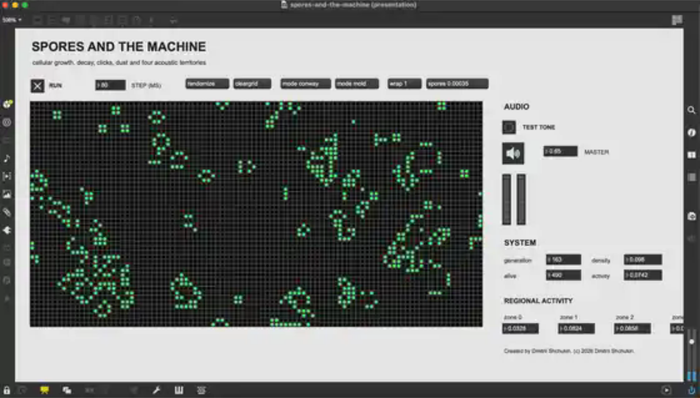

# Spores and the machine

*A cellular automaton reconstructed and sonified anew in Max/MSP.*

  

## About

**Spores and the machine** is a Max/MSP study of cellular growth, decay, movement, and sound. The repository contains two related instruments:

- `spores-and-the-machine.maxpat` preserves the original Conway/mold reconstruction;
- `spores-organisms.maxpat` develops the idea into soft-bodied organisms with membranes, nuclei, food, metabolism, division, death, and individual acoustic voices.

The project begins with [Conway's Game of Life](https://en.wikipedia.org/wiki/Conway%27s_Game_of_Life), a zero-player cellular automaton devised by John Horton Conway in 1970. In the classical version, each location is either alive or dead and changes according to its eight neighbours. The rule is commonly written as **B3/S23**: birth with three neighbours, survival with two or three.

## Classic cellular mode

The original patch extends Conway's rule with optional toroidal wrapping, rare spontaneous spores, automatic reinjection after prolonged inactivity, and a three-state `mold` mode:

`empty → growing → exhausted → empty`

Its matrix is divided into acoustic territories containing layered `click~` streams, resonant filters, and short `cycle~` grains.

## Organism mode

Open `spores-organisms.maxpat` for the advanced model.

The visual field is **160 × 90**, but the organisms are no longer assembled by independently adding and deleting grid pixels. Each body is generated from one closed radial contour and filled as a continuous polygon.

This refactor solves two problems at once:

- the membrane remains closed, so organisms cannot disintegrate into disconnected islands;
- the engine calculates dozens of contour points instead of repeatedly scanning hundreds of occupied pixels.

Colors indicate different functions:

- bright organism color: membrane;
- darker organism color: cytoplasm;
- pale center: nucleus;
- magenta point: movement polarity;
- amber field: nutrients.

Each organism:

- senses nearby nutrients and develops a movement direction;
- expands slightly at the front and contracts at the rear;
- changes shape through smoothed radial harmonics;
- moves with a continuous membrane;
- carries a nucleus with its own inertia;
- consumes food and spends energy;
- can divide into two organisms;
- releases nutrients when it dies.

This is an artistic soft-body model, not a medical or molecular simulation.

## Performance refactor

The nutrient field is simulated internally at **80 × 45**, then sampled into the larger display. Visual rendering, audio control output, and nutrient diffusion run at separate rates.

The patch now uses `qmetro`, so drawing work may be deferred when Max is busy with audio instead of freezing the interface.

Three modes are available directly in Presentation Mode:

- `quality low`: 20 contour points, rendering every three steps;
- `quality medium`: 28 contour points, rendering every two steps;
- `quality high`: 36 contour points, rendering every step.

`quality medium` is the default. For the lightest operation use `quality low`, five organisms, and a step of 140–180 ms.

## Organism sonification

Up to eight organisms can receive independent stereo voices. Five are created by default.

Each voice now uses a lighter structure:

- two irregular resonant `click~` streams;
- one short `cycle~` grain layer;
- one event accent for feeding, division, and death.

Mappings:

- vertical position → spectral register, approximately 70 Hz to 11 kHz;
- horizontal position → stereo placement;
- polygon area → sonic mass;
- movement speed → click density;
- contour variation → resonance and irregularity;
- energy → loudness;
- feeding, division, and death → transient accents.

One organism therefore has one body and one audible identity. Humanity has finally granted administrative unity to an amoeba.

## Requirements

- Max 8 or newer;
- no external packages;
- a working audio output selected in Max.

## Running organism mode

1. Download or clone the repository.
2. Keep `spores-organisms.maxpat`, `organism-engine.js`, and `organism.voice.maxpat` in the same folder.
3. Open `spores-organisms.maxpat`. It opens in Presentation Mode.
4. Enable the loudspeaker button.
5. Leave `quality medium` selected for the first run.
6. Turn on **RUN**.
7. Use `reset 5` for the default population or `reset 8` for the maximum population.
8. Use `addfood 10` to add nutrient clusters.
9. Adjust **FOOD**, **MUTATION**, **STEP (MS)**, and **MASTER**.

Recommended starting values:

- `STEP (MS)`: `120`;
- `FOOD`: `0.010`;
- `MUTATION`: `0.12`;
- `MASTER`: `0.38`.

## Files

- `spores-and-the-machine.maxpat` — classic Conway/mold instrument;
- `spores-and-the-machine.js` — classic automaton engine;
- `spore.voice.maxpat` — classic territory voice;
- `spores-organisms.maxpat` — optimized organism interface;
- `organism-engine.js` — contour bodies, nutrient field, lifecycle, and rendering;
- `organism.voice.maxpat` — one lightweight organism voice;
- `presets/organism-defaults.json` — default performance and biology values;
- `docs/ORGANISM_MODEL.md` — biological behaviour and mappings;
- `docs/PERFORMANCE_REFACTOR.md` — performance architecture and quality modes.

Created by Dmitrii Shchukin.  
(c) 2026 Dmitrii Shchukin.
