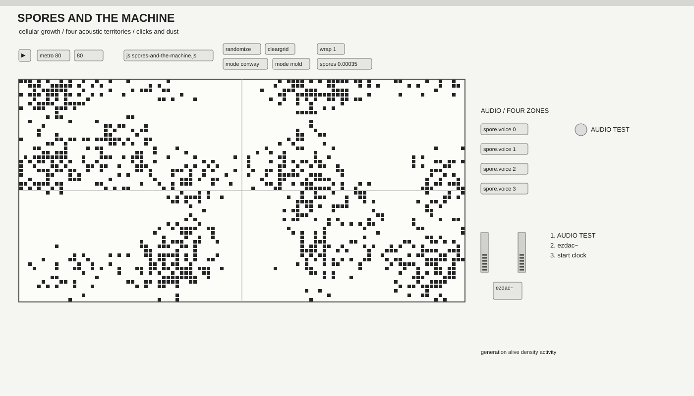

# spores-and-the-machine

**spores-and-the-machine** is a small Max/MSP study in cellular growth, decay and sonification.

The project begins with Conway's Game of Life and extends it into a three-state mold-like automaton. The grid behaves less like a score and more like a synthetic organism: cells emerge, form colonies, exhaust themselves, disappear and return as spores.

The matrix is divided into four acoustic territories. Each territory controls a stereo voice made from short sine grains, clicks and noise:

- local activity controls amplitude;
- vertical position controls register;
- each territory occupies a different stereo position;
- stable or dead regions become silent because the sound follows change, not mere existence.

## Why it does not freeze immediately

Classic Conway rules naturally settle into still lifes and short oscillators, especially on a finite grid. This version adds optional toroidal wrapping, a very small probability of spontaneous spores, automatic reinjection after prolonged inactivity, and a three-state `mold` mode: empty → growing → exhausted → empty.

## Requirements

- Max 8 or newer;
- no external packages;
- a configured audio output in Max.

## How to run

1. Download or clone the repository.
2. Keep `spores-and-the-machine.maxpat`, `spores-and-the-machine.js` and `spore.voice.maxpat` in the same folder.
3. Open `spores-and-the-machine.maxpat`.
4. Switch on `ezdac~`, then click **AUDIO TEST**. You should hear a short 440 Hz tone.
5. Click `randomize` and start the generation toggle in the upper-left corner.
6. Switch between `mode conway` and `mode mold`.

If **AUDIO TEST** is audible but the automaton remains silent, check that the generation and activity values are changing. If the test tone is also silent, open **Options → Audio Status** and select the correct output device.

You can stop the clock and draw cells directly into the matrix.

## Controls

- `randomize` creates a new colony;
- `cleargrid` clears the matrix and the JavaScript state;
- `mode conway` uses B3/S23 rules;
- `mode mold` uses the three-state growth/decay system;
- `wrap 1` connects opposite edges;
- `spores 0.00035` sets spontaneous growth probability;
- the number beside the clock sets generation time in milliseconds.

## Files

- `spores-and-the-machine.maxpat` — main interface and audio routing;
- `spores-and-the-machine.js` — automaton, matrix updates and regional analysis;
- `spore.voice.maxpat` — one reusable click/noise voice, instantiated four times;
- `images/interface.svg` — interface preview used in this README.

The project deliberately remains small. A later version could identify connected colonies and map their area, perimeter, age, splitting and merging to sound.

Created by Dmitrii Schtschukin.
