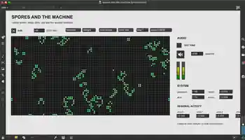

# Spores and the machine

* A cellular automaton reconstructed and sonified anew in Max/MSP.

## About

**Spores and the machine** is a compact Max/MSP study of cellular growth, decay, motion, and sound.

The project begins with [Conway's Game of Life](https://en.wikipedia.org/wiki/Conway%27s_Game_of_Life), a zero-player cellular automaton devised by John Horton Conway in 1970. Its world is a grid of cells that are either alive or dead. At every generation, all cells are updated simultaneously according to the eight cells surrounding them:

- a living cell survives when it has two or three living neighbours;
- a living cell dies from isolation or overcrowding in every other case;
- a dead cell is born when it has exactly three living neighbours.

This rule is commonly written as **B3/S23**: birth with three neighbours, survival with two or three.

The original system often settles into still lifes or short repeating oscillators. This reconstruction keeps the classical mode, but also adds optional toroidal wrapping, rare spontaneous spores, automatic reinjection after prolonged inactivity, and an alternative three-state `mold` mode:

`empty → growing → exhausted → empty`

The additional state makes growth and disappearance more visible and prevents the field from becoming a permanently frozen picture after only a few generations.

## Sonification

The visual automaton is not translated cell by cell. A separate `click~` object for every living point would produce hundreds or thousands of simultaneous DSP objects and would mostly convert the computer into an expensive hand warmer.

Instead, the matrix is divided into four acoustic territories. Each territory controls **three independent click layers**, giving twelve asynchronous click generators in total. Each layer uses a short impulse wavetable, a resonant band-pass filter, and its own irregular clock.

The mapping works as follows:

- **vertical position → frequency**  
  Cells near the top produce high resonances, reaching approximately 10 kHz. Cells near the bottom produce low clicks and pulses down to roughly 55 Hz;

- **local density and activity → rate**  
  Dense, rapidly changing areas generate faster click streams. Sparse areas create slower and more isolated events;

- **births and deaths → accents**  
  New and disappearing cells trigger additional impulses, so changes in the pattern are heard immediately;

- **horizontal position → stereo placement and spectral spread**  
  Left and right colonies move across the stereo image, while their position also separates the secondary resonant frequencies;

- **activity → resonance**  
  More active territories produce sharper, more ringing clicks. Quiet territories soften and eventually fall silent.

The result is a shifting field of small impulses rather than a continuous drone: low clusters, high particulate textures, isolated ticks, and denser bursts coexist as the cellular structures move.

## Requirements

- Max 8 or newer;
- no external packages;
- a working audio output selected in Max.

## How to run

1. Download or clone the repository.
2. Keep `spores-and-the-machine.maxpat`, `spores-and-the-machine.js`, and `spore.voice.maxpat` in the same folder.
3. Open `spores-and-the-machine.maxpat`. It opens directly in Presentation Mode.
4. Click **TEST TONE**. The patch enables DSP and plays a short 440 Hz tone.
5. Click `randomize`.
6. Turn on **RUN**.
7. Switch between `mode conway` and `mode mold`.
8. Adjust **STEP (MS)** and **MASTER** as needed.

The two meters should move whenever the test tone or the cellular voices produce a signal. If the meters move but nothing is audible, select the correct output device under **Options → Audio Status**.

You can stop the clock and draw cells directly into the matrix.

## Controls

- `randomize` creates a new colony;
- `cleargrid` clears both the visible matrix and the JavaScript state;
- `mode conway` uses the B3/S23 Game of Life rules;
- `mode mold` uses the three-state growth and decay system;
- `wrap 1` connects opposite edges of the field;
- `spores 0.00035` sets spontaneous growth probability;
- **STEP (MS)** controls generation speed;
- **MASTER** controls output level.

## Files

- `spores-and-the-machine.maxpat` — the main patch and Presentation Mode interface;
- `spores-and-the-machine.js` — the automaton, matrix updates, and regional analysis;
- `spore.voice.maxpat` — a three-layer click synthesizer instantiated once for each territory;
- `images/interface.webp` — the actual Max/MSP screenshot shown above.

## Scope

This version deliberately remains small. It does not identify and track individual connected colonies. A future version could use connected-component analysis to map the area, perimeter, age, splitting, and merging of individual colonies to sound.

Created by Dmitrii Shchukin.  
(c) 2026 Dmitrii Shchukin.
